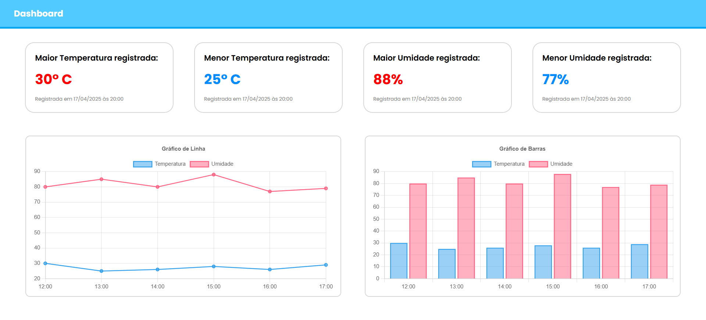

# Atividade – Dashboard de Temperatura e Umidade 🌡️💧

Atividade simples com visualização de:

- Maiores e menores valores de temperatura e umidade
- Gráficos de linha e barra com Chart.js

## Tecnologias utilizadas 🛠️

- HTML  
- CSS  
- JavaScript  
- Chart.js

## Resultado do Código

